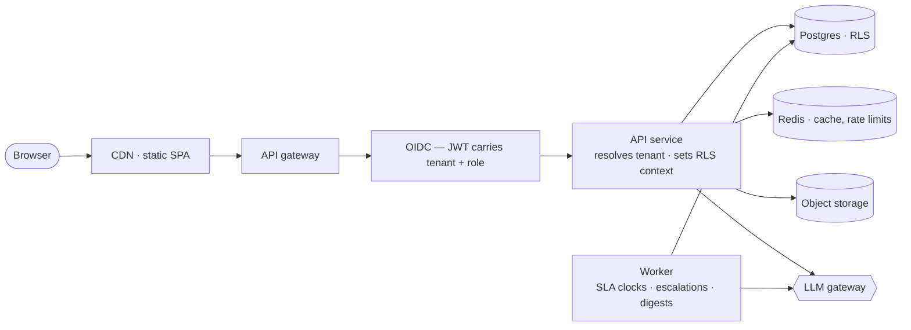

# ARCH-001 · SaaS & on-prem productization strategy

How Rewive becomes a product that serves many customers from one hosted
platform, and can also be handed to a customer to run themselves — without the
second thing doubling the cost of the first.

Downstream: [[ARCH-002-multi-cloud-hosting|ARCH-002]] maps this onto specific
clouds; [[ARCH-003-azure-hld|ARCH-003]] and [[ARCH-004-azure-lld|ARCH-004]] make
it concrete on Azure; [[PROD-001-access-control|PROD-001]] specifies the
in-tenant permission model that sits above the tenancy boundary.

---

## Entry 01 · The rule that makes both possible

**One codebase, one artifact set, two deployment targets.** The moment on-prem
becomes a fork or a "special build", maintenance cost doubles and never comes
back down.

Everything else follows from this:

- Ship the product as **containers** — frontend bundle, API, worker, migration
  job. SaaS is Rewive running those containers; on-prem is the customer running
  the exact same ones.
- All environment differences are **configuration, not code**: database URL,
  auth provider, LLM provider, SMTP, object storage.
- Anything SaaS-only — billing, telemetry, the internal admin console — lives
  behind a feature flag or in a separate service that simply isn't shipped
  on-prem. Never `if (onPrem)` branches scattered through product logic.

---

## Entry 02 · Tenancy model

**Pooled Postgres with row-level security.** One shared database; every
tenant-owned table carries a `tenant_id` column; RLS policies filter every query
against a per-request `app.tenant_id` setting.

This is the default for good reasons: one database to migrate, back up, and
monitor, and isolation enforced by the database rather than by developer
discipline.

- **Schema-per-tenant is rejected** — the worst of both worlds: migration
  fan-out and connection-pool pain, with few of the benefits of true isolation.
- **Database-per-tenant is kept as an escape hatch** for large or regulated
  customers. Because the data layer resolves its connection from tenant context,
  a "siloed tier" later is a configuration entry, not a rewrite. That same
  abstraction is most of the on-prem story.

```sql
ALTER TABLE findings ENABLE ROW LEVEL SECURITY;
ALTER TABLE findings FORCE ROW LEVEL SECURITY;

CREATE POLICY tenant_isolation ON findings
  USING (tenant_id = current_setting('app.tenant_id')::uuid);
```

The API's database role must never hold `BYPASSRLS`, and a cross-tenant leak
test runs in CI on every deploy.

---

## Entry 03 · Request flow



Specific to Rewive:

- **Tenant resolution** by subdomain (`americana.rewive.app`) or from the JWT.
  Subdomains are worth it here — per-tenant brand accents already assume them.
- **The SLA and escalation engine is the hardest piece.** "Nothing drifts
  unanswered" means timers must fire reliably, so this cannot be in-process
  `setInterval`. Use a durable job system. Preferred: a **Postgres-backed
  queue** (Graphile Worker), which removes Redis as a hard dependency for
  on-prem and keeps queue state and domain state in one consistency domain.
- **LLM calls** go through a single internal module with per-tenant credential
  resolution, rate limiting, and usage metering. This is both SaaS cost control
  and the on-prem swap point (customer's own key, or Bedrock/Vertex/Foundry).
- **Retire Vercel KV.** It doesn't exist on-prem; depend only on things that run
  anywhere.
- **Auth** behind an OIDC abstraction — hosted IdP for SaaS, the customer's IdP
  (Entra, Okta, Keycloak) on-prem. Enterprise buyers ask for SSO long before
  they ask for on-prem.

**Platform services**, kept separate from product code: billing, tenant
provisioning and admin console, usage metering, status page, telemetry ingest.

---

## Entry 04 · On-prem packaging

Sell it in tiers. Most customers who say "we need on-prem" are satisfied by a
**single-tenant dedicated deployment** ("private SaaS") at a higher price. Offer
that first; true self-hosted only when they insist.

For true self-hosted:

1. **The artifact is a versioned Helm chart plus container images**, with a
   Docker Compose bundle for small deployments and proofs of concept. Same
   images as SaaS, tagged releases.
2. **Externalized dependencies with sane defaults.** The chart can deploy
   Postgres and Redis for a POC, but production documentation says "point at
   your own Postgres". Fewer stateful things shipped means fewer things
   supported.
3. **Licensing** — a signed license file (JWT signed with the Rewive private
   key) checked at boot: expiry, seat count, feature tier. Fail *soft* — warn,
   then degrade to read-only. Hard kills generate emergency support calls.
4. **Air-gap support only when a customer pays for it.** `docker save` image
   bundles plus offline licensing. Don't build it speculatively.
5. **Consider Replicated** (or KOTS / Embedded Cluster) once there are more than
   two or three on-prem customers — it productizes installers, air-gap, license
   checks, and support bundles.
6. **Telemetry** — opt-in, documented phone-home: version, health, usage counts,
   never customer data. Enterprises will audit it, so make it inspectable.
7. **A support-bundle command** — one CLI call that dumps logs, redacted config,
   versions, and health checks into a tarball the customer can email. The
   highest-leverage single investment in on-prem supportability.

---

## Entry 05 · Maintaining both without drowning

- **Release trains.** SaaS deploys continuously from `main`. On-prem gets a cut
  every month or quarter from that same `main` (e.g. `2026.08`), with the last
  two or three trains supported.
- **Migrations are the contract.** Forward-only, backwards-compatible for one
  version, run automatically at startup as a chart job. On-prem customers skip
  versions — document and test supported upgrade paths.
- **No customer forks, ever.** Customer asks become configuration options or
  feature flags in `main`. The first fork shipped is a product maintained
  forever.
- **Feature flags with a static provider on-prem** — same flag system, config
  file instead of a hosted service.
- **Test the on-prem artifact in CI.** A nightly job installs the chart into a
  throwaway cluster, migrates from train N−1, and smoke-tests. On-prem bugs
  found by customers cost roughly ten times what SaaS bugs cost, because you
  can't just redeploy their cluster.
- **Put the version-support policy in the contract** before the first deal:
  which versions are supported, upgrade cadence, and that LLM features require
  either egress to Anthropic or a customer-provided model endpoint.

---

## Entry 06 · Sequencing from today

1. **Now** — replace the mock server with a real API on Postgres, and introduce
   the tenant-scoped data layer plus RLS from day one. Retrofitting tenancy is
   the expensive version of this project.
2. **Containerize immediately**, even while still deploying to a PaaS, so the
   artifact story is settled early. Move off Vercel KV.
3. **SaaS launch** — OIDC auth, durable job worker for the SLA engine, billing,
   per-tenant subdomains.
4. **First enterprise pull** — offer the single-tenant dedicated tier.
5. **Only against a signed on-prem deal** — Helm chart, license file, support
   bundle, release-train process.

The three abstractions to get right early are **tenant-scoped data access**,
**pluggable OIDC auth**, and a **wrapped LLM provider**. With those in place,
SaaS versus on-prem is a packaging problem rather than an engineering one.
