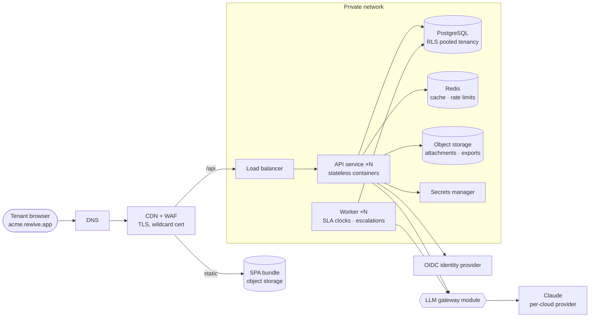
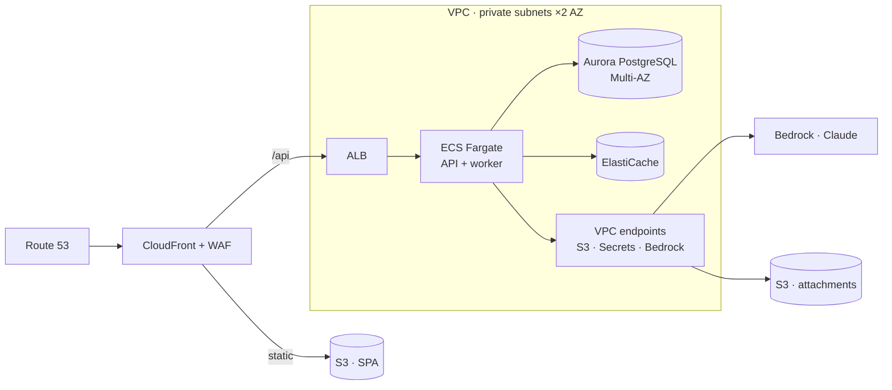
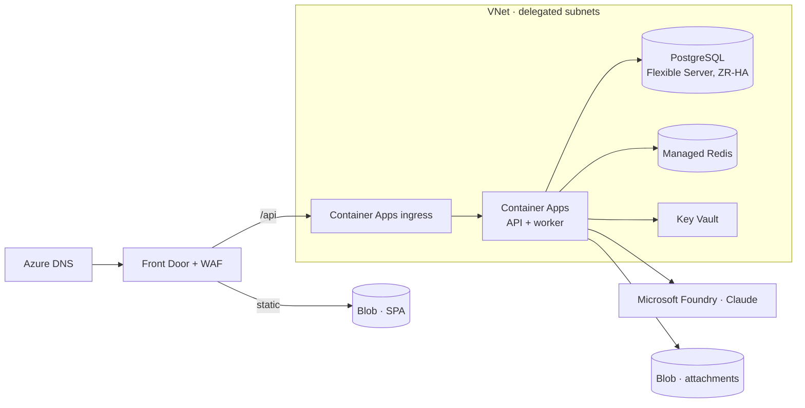
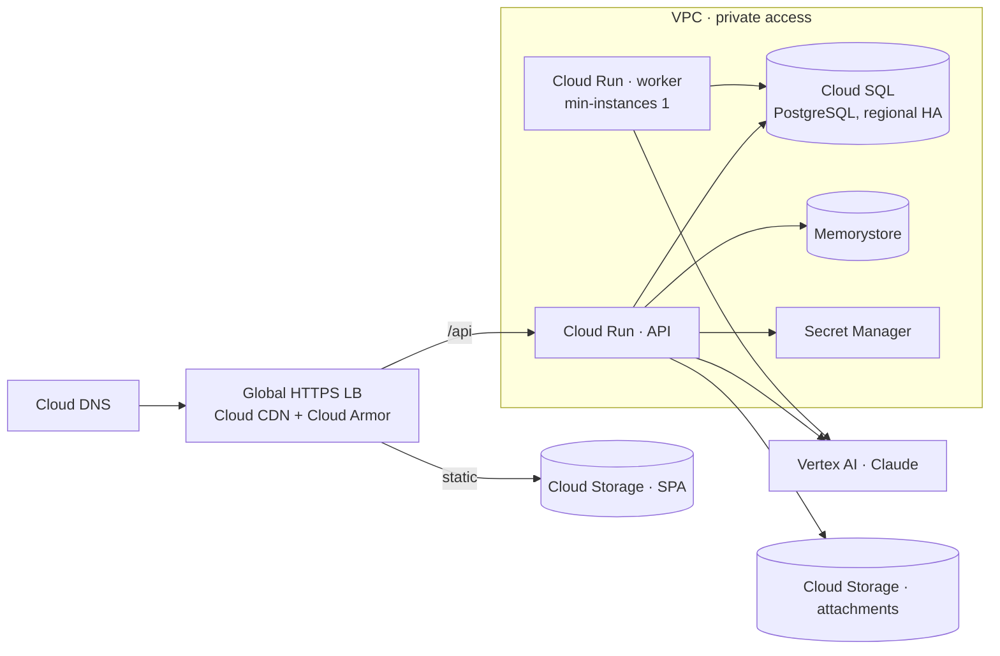
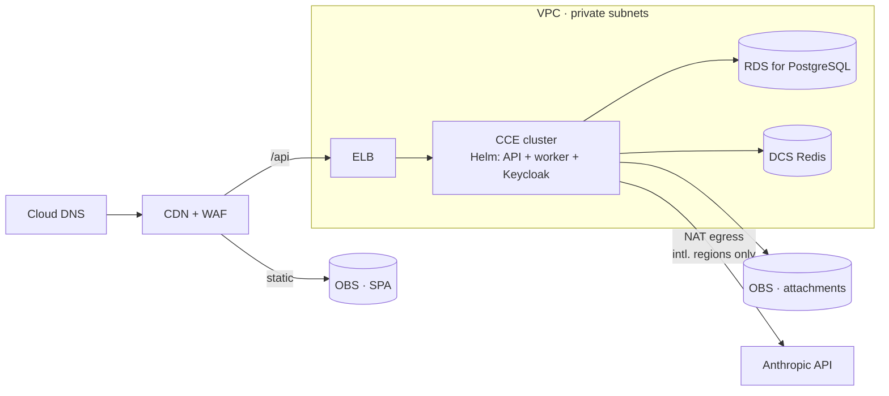

# ARCH-002 · Multi-cloud hosting architecture

One portable reference architecture for Rewive, and its mapping onto AWS,
Microsoft Azure, Google Cloud, and Huawei Cloud — for both the pooled
multi-tenant SaaS and dedicated single-tenant deployments.

Builds on [[ARCH-001-productization-strategy|ARCH-001]]. The Azure mapping is
expanded in [[ARCH-003-azure-hld|ARCH-003]] and [[ARCH-004-azure-lld|ARCH-004]].

---

## Entry 01 · Scope & deployment modes

Rewive ships as three containers plus a static bundle: the **SPA** (React 19 +
Vite), the **API** (Express, stateless, JWT-authenticated, tenant-scoped), the
**worker** (SLA clocks, escalations, digests, LLM jobs), and a **migration
job**. State lives in PostgreSQL (pooled tenancy with row-level security), Redis
(cache and rate limits), and object storage (attachments, exports).

| Mode | Who runs it | Runtime | When |
|---|---|---|---|
| Pooled SaaS | Rewive, on one *home cloud* | Managed serverless containers (Fargate / Container Apps / Cloud Run) | Default for all customers; cheapest to operate, continuous deploys |
| Dedicated / single-tenant | Rewive-managed in the customer's cloud, or customer-run | The on-prem **Helm chart** on managed Kubernetes (EKS / AKS / GKE / CCE) | Data residency, procurement, or regulatory pull toward a specific cloud |

> [!important] Key decision
> Rewive does **not** run the pooled SaaS active-active across four clouds. The
> SaaS lives on one home cloud; the other three mappings exist so a dedicated
> deployment can land wherever a contract demands. The unit of portability is
> the same Helm chart built for on-prem — one artifact covers Kubernetes on all
> four clouds *and* self-hosted.

---

## Entry 02 · Portable reference architecture

Two properties make the four mappings cheap. First, the worker takes its jobs
from a **Postgres-backed queue** (Graphile Worker), so the SLA engine has
identical semantics on every cloud and needs no proprietary queue service.
Second, all environment differences enter through configuration — the
portability contract below.

### The portability contract

| Rule | Statement |
|---|---|
| **R-01** | **Compute is OCI containers.** Any managed container runtime may host them; nothing assumes a specific orchestrator. |
| **R-02** | **State is Postgres, Redis, and S3-compatible object storage — nothing else.** No cloud-proprietary databases, queues, or KV stores in product code. |
| **R-03** | **Background jobs run on the Postgres-backed queue.** Cron-like schedules live in the worker, not in cloud schedulers, so SLA timing is testable and identical everywhere. |
| **R-04** | **Auth is OIDC behind one abstraction.** SaaS uses a hosted IdP; dedicated deployments point at the customer's IdP by configuration. |
| **R-05** | **All LLM calls pass through one gateway module** that resolves provider, model, credentials, and per-tenant rate limits from config. |
| **R-06** | **Infrastructure is Terraform, one module per cloud, one shared interface.** One CI pipeline builds one image set and pushes to each target registry. |
| **R-07** | **Secrets come from the platform secrets manager, injected as env vars.** The app never embeds cloud SDK calls for secret retrieval. |

---

## Entry 03 · AWS

The strongest default home cloud: Claude is a first-party model on **Amazon
Bedrock**, reachable over a VPC endpoint so LLM traffic never leaves the private
network — a line that lands well in security reviews.

| Layer | Service | Notes |
|---|---|---|
| Edge / CDN | Route 53 · CloudFront · AWS WAF · ACM | Wildcard cert for `*.rewive.app`; CloudFront serves the SPA and forwards `/api` |
| SPA hosting | S3 (private, OAC) behind CloudFront | |
| API + worker | ECS on Fargate behind an ALB | Dedicated mode: EKS with the standard Helm chart |
| PostgreSQL | Aurora PostgreSQL (or RDS to start) | Multi-AZ; RLS works unchanged; RDS Proxy for pooling |
| Redis | ElastiCache (Valkey/Redis) | |
| Object storage | S3 | The reference S3 API — no adapter needed |
| Secrets | Secrets Manager + KMS | Injected into tasks as env vars |
| LLM | Amazon Bedrock — Claude | Private access via PrivateLink; per-tenant metering in the gateway |
| Registry / CI | ECR · GitHub Actions (OIDC federation) | No long-lived keys |
| Observability | CloudWatch Logs + Metrics · X-Ray optional | |
| Email | SES | Escalation and digest notifications |

---

## Entry 04 · Azure

The natural landing zone for enterprise customers standardized on Microsoft:
Entra ID SSO is usually the actual requirement behind "must run on Azure".
Claude is available through **Microsoft Foundry**; the LLM gateway can also fall
back to the direct Anthropic API.

| Layer | Service | Notes |
|---|---|---|
| Edge / CDN | Azure DNS · Front Door (Standard) + WAF | Front Door terminates TLS and routes static vs `/api` |
| SPA hosting | Blob Storage static website behind Front Door | |
| API + worker | Azure Container Apps | KEDA-based scaling; dedicated mode: AKS with the Helm chart |
| PostgreSQL | Azure Database for PostgreSQL — Flexible Server | Zone-redundant HA; PgBouncer built in |
| Redis | Azure Managed Redis | |
| Object storage | Blob Storage | Not S3-compatible — covered by the storage adapter |
| Secrets | Key Vault | Container Apps secret references |
| LLM | Claude in Microsoft Foundry | Fallback: direct Anthropic API via NAT egress |
| Registry / CI | ACR · GitHub Actions (workload identity federation) | |
| Observability | Azure Monitor + Application Insights + Log Analytics | |
| Identity | Entra ID / Entra External ID | Slots in behind the OIDC abstraction |

Expanded in [[ARCH-003-azure-hld|ARCH-003]] (design) and
[[ARCH-004-azure-lld|ARCH-004]] (configuration).

---

## Entry 05 · Google Cloud

The leanest serverless expression of the architecture: Cloud Run maps
one-to-one onto stateless containers, and Claude is first-party on **Vertex
AI**. A strong home-cloud alternative to AWS if operating simplicity decides it.

| Layer | Service | Notes |
|---|---|---|
| Edge / CDN | Cloud DNS · Global External Application LB · Cloud CDN · Cloud Armor | One global anycast IP; managed wildcard cert |
| SPA hosting | Cloud Storage bucket as LB backend, CDN-cached | |
| API + worker | Cloud Run services | Worker runs with `min-instances ≥ 1` (always-on CPU) so SLA clocks never sleep; dedicated mode: GKE + Helm chart |
| PostgreSQL | Cloud SQL for PostgreSQL (AlloyDB when needed) | Regional HA; private IP via Private Service Connect |
| Redis | Memorystore | |
| Object storage | Cloud Storage | S3-interoperable XML API eases the adapter |
| Secrets | Secret Manager | Native Cloud Run integration |
| LLM | Claude on Vertex AI | Regional endpoints help EU data-residency stories |
| Registry / CI | Artifact Registry · GitHub Actions (workload identity federation) | |
| Observability | Cloud Logging + Monitoring + Trace | |

---

## Entry 06 · Huawei Cloud

For customers in markets where Huawei Cloud is mandated or dominant (Middle
East, parts of APAC, Africa, LatAm). The dedicated-mode Helm chart runs
unmodified on **CCE**, which is CNCF-certified Kubernetes — a values-file
exercise, not new engineering. Treat Huawei as a dedicated-deployment target
only, never a pooled-SaaS home.

| Layer | Service | Notes |
|---|---|---|
| Edge / CDN | Huawei Cloud DNS · CDN · WAF | |
| SPA hosting | OBS static website behind CDN | |
| API + worker | CCE (Cloud Container Engine) + the standard Helm chart | CCI possible, but CCE keeps parity with the on-prem artifact |
| PostgreSQL | RDS for PostgreSQL | Verify version parity with the migration baseline; GaussDB is **not** a drop-in — avoid |
| Redis | DCS for Redis | |
| Object storage | OBS | S3-compatible API — existing adapter works |
| Secrets | DEW / CSMS | Or Kubernetes secrets sealed via the chart, matching on-prem practice |
| LLM | Direct Anthropic API via NAT egress | No Claude offering on Huawei Cloud — see constraint |
| Registry / CI | SWR · images mirrored from the primary registry by CI | |
| Observability | Cloud Eye · AOM · LTS | Or the chart's Prometheus/Grafana profile for parity |
| Identity | No managed customer-IdP equivalent | Keycloak from the Helm chart, or the customer's IdP over OIDC |

> [!warning] Constraint — LLM features
> Anthropic's API is not available from mainland China, and there is no Claude
> offering on Huawei Cloud. Deployments in Huawei's international regions (for
> example Singapore, Riyadh, Johannesburg) reach the Anthropic API over NAT
> egress with the customer's own key. For mainland-China regions, LLM-assisted
> features must be disabled by feature flag — sell the deterministic SLA and
> escalation core, which stands on its own. Put this in the contract before the
> deal closes.

---

## Entry 07 · Cross-cloud service matrix

| Layer | AWS | Azure | GCP | Huawei |
|---|---|---|---|---|
| Serverless containers | ECS Fargate | Container Apps | Cloud Run | CCI *(prefer CCE)* |
| Kubernetes (dedicated) | EKS | AKS | GKE | CCE |
| PostgreSQL | Aurora / RDS | Flexible Server | Cloud SQL / AlloyDB | RDS for PostgreSQL |
| Redis | ElastiCache | Managed Redis | Memorystore | DCS |
| Object storage | S3 | Blob Storage | Cloud Storage | OBS |
| CDN | CloudFront | Front Door | Cloud CDN | Huawei CDN |
| Load balancer | ALB | Front Door / App GW | Global HTTPS LB | ELB |
| WAF | AWS WAF | Front Door WAF | Cloud Armor | Huawei WAF |
| DNS | Route 53 | Azure DNS | Cloud DNS | Huawei DNS |
| Secrets | Secrets Manager | Key Vault | Secret Manager | DEW / CSMS |
| KMS | KMS | Key Vault keys | Cloud KMS | DEW KMS |
| Registry | ECR | ACR | Artifact Registry | SWR |
| Claude access | Bedrock *(first-party, PrivateLink)* | Microsoft Foundry | Vertex AI *(first-party)* | Direct API *(intl. only; off in CN)* |
| Monitoring | CloudWatch | Monitor + App Insights | Cloud Ops suite | Cloud Eye / AOM / LTS |
| Email | SES | ACS Email | 3rd-party (SendGrid) | 3rd-party SMTP |
| Identity option | Cognito *(default: WorkOS)* | Entra External ID | Identity Platform | Keycloak *(via Helm)* |

Rows that never vary — Postgres semantics, the job queue, the Helm chart, the
OIDC contract — are the architecture. Rows that vary are procurement. Keeping
that line sharp is what makes a fifth cloud a two-week exercise instead of a
quarter.

---

## Entry 08 · Operations, HA/DR & choosing a cloud

### Availability & disaster recovery

- **In-region HA everywhere** — at least two API replicas across zones,
  zone-redundant Postgres, and idempotent workers so an instance loss never
  double-fires an escalation.
- **Backups** — point-in-time recovery on Postgres (35-day window), nightly
  logical dumps to object storage with cross-region replication. RPO ≤ 5 min,
  RTO ≤ 4 h for the SaaS; dedicated deployments state their own targets in the
  order form.
- **DR posture** — warm standby is overkill at this stage. Restore from backup
  into a second region, rehearsed quarterly with a timed drill. Promote to
  pilot-light only when a contract demands a tighter RTO.
- **SLA-engine integrity** — the queue lives in Postgres, so the database
  restore point *is* the escalation-state restore point. One consistency
  domain, no queue/database drift after recovery.

### Environments & release flow

- Home cloud runs `dev` → `staging` → `prod`, continuous deploys from `main`.
- Dedicated deployments track the monthly release train (e.g. `2026.08`),
  upgraded by `helm upgrade` with migrations run automatically as a pre-upgrade
  job. Last three trains supported.
- Nightly CI installs the chart into a throwaway cluster, migrates from train
  N−1, and smoke-tests. The same job gates every cloud, since the artifact is
  identical.
- Per-cloud Terraform state stays per-cloud; there is no cross-cloud
  orchestration layer. Each dedicated deployment is a Terraform workspace plus a
  Helm values file.

### Which cloud, when

| Situation | Recommendation |
|---|---|
| Pooled SaaS home | **AWS** — first-party Claude on Bedrock over PrivateLink, deepest managed-Postgres options. **GCP** is a close second if Cloud Run's operational simplicity is decisive. |
| Microsoft-standardized enterprise | **Azure** dedicated deployment; Entra ID over the OIDC abstraction. Often what "we need on-prem" actually means. |
| EU data residency | Dedicated deployment pinned to an EU region on any hyperscaler; GCP Vertex AI regional endpoints keep LLM traffic in-region. |
| MEA / APAC mandate | **Huawei** international region, dedicated mode, customer's Anthropic key over NAT. |
| Mainland China | Huawei CN region with LLM features flagged off — or decline; ICP licensing and support burden must price into the deal. |
| Air-gapped / sovereign | The on-prem Helm bundle itself; cloud choice becomes moot. |

> [!note] Sequencing
> Build in this order: **(1)** home-cloud SaaS on serverless containers,
> **(2)** the Helm chart for on-prem, **(3)** — only against signed deals — the
> Azure, GCP, and Huawei Terraform modules that host that same chart. Steps 1–2
> are product engineering; step 3 is repetition.
