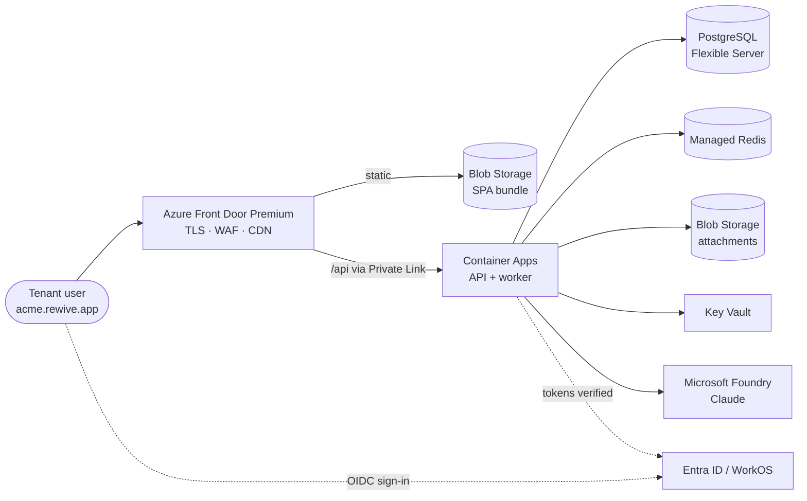
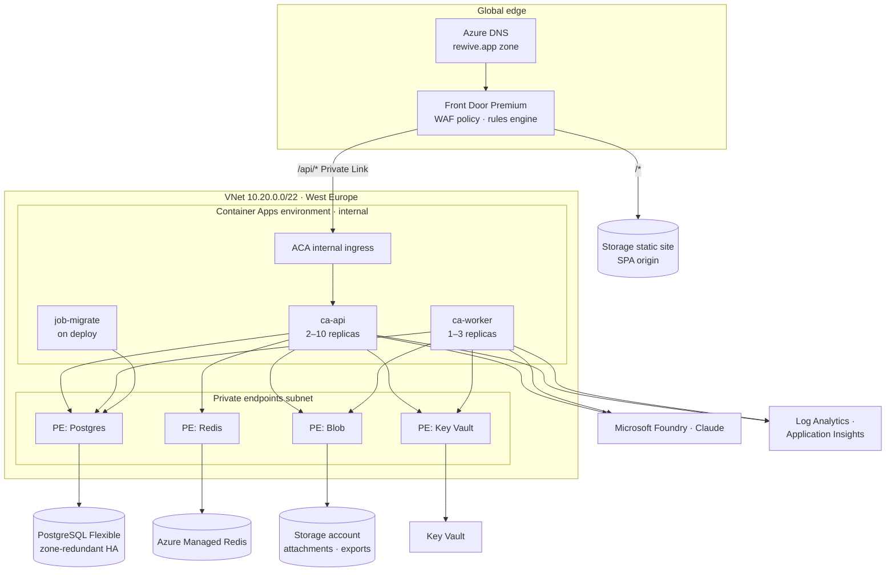

# ARCH-003 · Rewive on Azure — High-Level Design

The solution architecture for running Rewive on Microsoft Azure: components,
environments, security model, availability targets, and cost envelope.

Companion LLD: [[ARCH-004-azure-lld|ARCH-004]]. Portability rules referenced as
R-01…R-07 come from [[ARCH-002-multi-cloud-hosting|ARCH-002]] Entry 02.

---

## Entry 01 · Purpose, scope & audience

This HLD defines how Rewive runs end-to-end on Azure — for the pooled
multi-tenant SaaS *or* a dedicated single-tenant deployment; the design is
identical, only tenancy configuration and scale differ. It is written for
engineering, for a customer's cloud and security review board, and as the source
of truth that [[ARCH-004-azure-lld|ARCH-004]] makes concrete.

**In scope:** compute, data, edge, identity, LLM integration, observability,
environments, HA/DR, cost.
**Out of scope:** application feature design, the on-prem Helm bundle
([[ARCH-002-multi-cloud-hosting|ARCH-002]] Entries 06–08), non-Azure clouds, and
in-tenant permissions ([[PROD-001-access-control|PROD-001]]).

| Reference | Document |
|---|---|
| [[ARCH-001-productization-strategy\|ARCH-001]] | SaaS & on-prem productization strategy |
| [[ARCH-002-multi-cloud-hosting\|ARCH-002]] | Multi-cloud hosting architecture |
| [[ARCH-004-azure-lld\|ARCH-004]] | Azure low-level design — resource configuration, IaC, runbooks |
| [[PROD-001-access-control\|PROD-001]] | In-product access control (application layer) |

---

## Entry 02 · Solution overview

Rewive is delivered as a static SPA (React 19 + Vite), a stateless API
(Express / Node 22), a background worker (SLA clocks, escalations, digests, LLM
jobs), and a migration job — all OCI containers. State lives in PostgreSQL
(pooled tenancy enforced by row-level security), Redis (cache, rate limits), and
object storage (attachments, exports).

On Azure this becomes: **Front Door** at the edge (TLS, WAF, CDN, per-tenant
wildcard subdomains), the SPA served from **Blob Storage**, the API and worker on
**Container Apps** inside a VNet, **PostgreSQL Flexible Server** and **Azure
Managed Redis** reached over private endpoints, secrets in **Key Vault**, Claude
via **Microsoft Foundry**, and **Azure Monitor / Application Insights** for
observability. All service-to-service auth uses managed identities; no
connection keys leave Key Vault.

---

## Entry 03 · Architecture decisions

| ID | Decision | Rationale · alternatives rejected |
|---|---|---|
| **AD-01** | Container Apps, not AKS, for the SaaS runtime | Serverless scale, no cluster to patch, KEDA built in. AKS reserved for dedicated deployments reusing the on-prem Helm chart. App Service rejected: weaker sidecar and job story. |
| **AD-02** | Front Door **Premium** with Private Link origin | Only Premium reaches a VNet-internal origin privately; the API has no public ingress at all. Standard tier plus header-pinning is the accepted dev/staging economy. |
| **AD-03** | PostgreSQL Flexible Server, zone-redundant HA, PG 16 | Managed HA and PITR; RLS tenancy works unchanged. Cosmos DB rejected (R-02). |
| **AD-04** | Background jobs stay on the Postgres-backed queue (Graphile Worker) | R-03; SLA state and queue share one consistency domain. Service Bus rejected for product code (fine for future platform-side integrations). |
| **AD-05** | Claude via Microsoft Foundry; direct Anthropic API as configured fallback | Keeps LLM spend on the Azure bill and inside Azure's data terms — the usual enterprise requirement. Both sit behind the LLM gateway (R-05). |
| **AD-06** | Managed identities everywhere; workload identity federation for CI | No long-lived credentials in code, pipelines, or app config. Key Vault holds only third-party secrets that cannot be identity-based. |
| **AD-07** | OIDC abstraction: WorkOS for pooled SaaS, Entra ID direct for dedicated Microsoft-shop tenants | R-04. Entra External ID kept as an option, not a dependency. |
| **AD-08** | Terraform (azurerm), not Bicep | One IaC language across all four clouds (R-06). Bicep rejected to avoid a second toolchain. |

---

## Entry 04 · Logical architecture

| Component | Azure service | Responsibility |
|---|---|---|
| Edge | Front Door Premium + WAF, Azure DNS | TLS for `*.rewive.app`, managed WAF rules, caching, routing static vs `/api`, tenant subdomain preserved to origin |
| SPA | Storage static website | Immutable, fingerprinted bundle per release; cache-controlled by Front Door |
| API | Container Apps `ca-api` | Stateless Express; OIDC verification, tenant resolution → Postgres RLS context; all reads and writes |
| Worker | Container Apps `ca-worker` | Graphile Worker consumer: SLA clocks, escalations, digests, LLM jobs; idempotent handlers |
| Migrations | Container Apps Job `job-migrate` | Forward-only schema migrations, run as a gated step of every deploy |
| Database | PostgreSQL Flexible Server | System of record; pooled tenancy via RLS; also hosts the job queue |
| Cache | Azure Managed Redis | Session-less cache, rate limits, hot tenant config |
| Files | Storage account (private) | Attachments and exports via short-lived SAS issued by the API |
| Secrets | Key Vault | Third-party secrets (WorkOS, SMTP, Anthropic fallback); referenced by Container Apps, never copied |
| LLM | Microsoft Foundry — Claude | Summaries, drafting, triage assists behind the gateway module with per-tenant metering |
| Observability | Log Analytics + App Insights | Traces, logs, metrics, alert rules, workbooks ([[ARCH-004-azure-lld\|ARCH-004]] Entry 08) |

> [!note] Tenancy at a glance
> A request to `acme.rewive.app/api/…` carries the tenant in the host header and
> the user's JWT. Middleware resolves the tenant, opens a transaction, sets
> `app.tenant_id`, and RLS policies scope every query. No application query ever
> names another tenant's rows; isolation is enforced in the database, not by
> discipline. What a user may do *within* their tenant is a separate,
> application-layer concern — see [[PROD-001-access-control|PROD-001]].

---

## Entry 05 · Environments & subscriptions

| Environment | Subscription | Purpose · differences from prod |
|---|---|---|
| prod | `sub-rewive-prod` | Pooled SaaS. Zone-redundant HA, Front Door Premium, private endpoints, geo-redundant backups, 35-day PITR. |
| staging | `sub-rewive-nonprod` | Production-shaped, one size smaller: no zone redundancy, Front Door Standard with header-pinned origin, 7-day PITR. Release-train rehearsal target. |
| dev | `sub-rewive-nonprod` | Cheapest faithful copy: burstable Postgres, no Front Door, no private endpoints. Reset at will. |
| Dedicated (per customer) | Customer's subscription or `sub-rewive-dedicated-*` | This same design, single-tenant values: AKS + Helm chart if the customer requires Kubernetes, else identical ACA layout. Region pinned by contract. |

- **Promotion path** — `main` → dev (continuous) → staging (on release cut) →
  prod (approved). Same Terraform modules, different `tfvars`; drift between
  environments is a build failure, not a surprise.
- **Isolation** — prod shares nothing with non-prod: separate subscriptions,
  VNets, Key Vaults, identities, and Entra app registrations.
- **Naming & tagging** — CAF-style names (`rg-rewive-prod-weu`, `ca-api-prod`)
  and mandatory tags (`env`, `owner`, `cost-center`, `release`); full convention
  in [[ARCH-004-azure-lld|ARCH-004]] Entry 01.

---

## Entry 06 · Security architecture

### Identity

- **Users** — OIDC through the product's auth abstraction: WorkOS (pooled SaaS)
  or the tenant's Entra ID (dedicated). JWTs carry `tenant_id` and a coarse role;
  the API never trusts a client-supplied tenant.
- **Workloads** — one user-assigned managed identity per app (`id-api-prod`,
  `id-worker-prod`) with least-privilege RBAC: `AcrPull`, `Key Vault Secrets
  User`, `Storage Blob Data Contributor` on the attachments container only. Full
  matrix in [[ARCH-004-azure-lld|ARCH-004]] Entry 06.
- **CI** — GitHub Actions federates via OIDC to an Entra app scoped to the
  target resource groups. No service-principal passwords exist.

> [!important] Layer boundary
> The platform guarantees **authentication** and **tenant isolation** only.
> In-tenant authorization — roles, team scoping, ownership rules, who may close
> a finding — is an application-layer product feature specified in
> [[PROD-001-access-control|PROD-001]]. Silence here is deliberate, not an
> omission.

### Network

- The Container Apps environment is **internal-only**; the sole path from the
  internet to the API is Front Door Premium over Private Link. Postgres, Redis,
  Blob, and Key Vault expose **private endpoints only**; public network access is
  disabled on each.
- Egress is limited to Foundry, the IdP, SMTP, and (if enabled) the Anthropic
  API; NSG and ACA egress rules enforce the allowlist.
- WAF: managed ruleset (DRS 2.1) plus bot manager in prevention mode; per-tenant
  rate limits at the edge complement API-level limits.

### Data protection

- Encryption at rest is platform-managed by default; **customer-managed keys**
  (Key Vault-backed CMK on Postgres and Storage) is a priced option for dedicated
  deployments, not a pooled-SaaS default.
- TLS 1.2+ end to end, including Front Door → origin. Attachments are
  private-only; access is via API-issued SAS tokens with minutes-scale expiry.
- Tenant deletion is an RLS-scoped hard delete plus blob prefix purge, executed
  by the worker with an auditable job record — supporting GDPR erasure
  timelines.
- LLM boundary: prompts carry the minimum tenant context; Foundry inference is
  stateless (no training on customer data per Microsoft and Anthropic terms); a
  tenant-level feature flag can disable LLM features entirely.

---

## Entry 07 · Availability, DR & capacity

| Concern | Design | Target |
|---|---|---|
| In-region HA | API ≥ 2 replicas across zones; Postgres zone-redundant HA (synchronous standby, automatic failover); Redis zone-redundant; worker replicas idempotent — an instance loss never double-fires an escalation | **99.9% monthly** |
| Backup | Postgres PITR (35 days) + geo-redundant backup to North Europe; nightly logical dump to geo-replicated Blob; Storage account GZRS | **RPO ≤ 5 min** |
| Regional DR | Restore-based: Terraform re-provisions in North Europe, Postgres geo-restore, Front Door origin swap. Rehearsed quarterly with a timed drill; runbook RB-3 in [[ARCH-004-azure-lld\|ARCH-004]] Entry 10 | **RTO ≤ 4 h** |
| SLA-engine integrity | The job queue lives inside Postgres — the database restore point *is* the escalation-state restore point; on recovery the worker resumes overdue clocks deterministically | No queue/DB drift |

### Capacity & scaling

- **API** — HTTP-concurrency scale rule (~50 concurrent per replica), min 2 /
  max 10. A replica at 0.5 vCPU / 1 GiB comfortably serves a mid-market tenant
  load; headroom is a max-replica change.
- **Worker** — KEDA PostgreSQL scaler on queue depth, min 1 / max 3. SLA ticks
  are cheap; LLM jobs dominate and are rate-limited per tenant.
- **Postgres** — start `D2ds_v5` (2 vCore / 8 GiB / 128 GiB); scale-up is an
  online operation. Read replicas deferred until reporting load demands them.
- **Growth trigger points**, reviewed monthly: p95 API latency > 400 ms,
  Postgres CPU > 60% sustained, queue lag > 30 s.

---

## Entry 08 · Cost model

| Component | Prod (monthly, est.) | Staging | Dev |
|---|---|---|---|
| Front Door | Premium ≈ €330 + traffic | Standard ≈ €35 | — (direct ingress) |
| Container Apps | ≈ €200–350 | ≈ €80 | ≈ €40 (scale-to-zero off-hours) |
| PostgreSQL | ≈ €350 (D2ds_v5 zone-redundant + storage/backup) | ≈ €140 (no HA) | ≈ €35 (B1ms burstable) |
| Managed Redis | ≈ €120 (Balanced B1) | ≈ €60 | ≈ €0 (in-app fallback cache) |
| Storage + DNS + Key Vault | ≈ €30 | ≈ €15 | ≈ €10 |
| Monitoring | ≈ €100 (~30 GB Log Analytics + sampled App Insights) | ≈ €40 | ≈ €20 |
| Foundry (Claude) | Usage-based, metered per tenant | capped | capped |
| **Order of magnitude** | **≈ €1,100–1,300 + LLM** | **≈ €370** | **≈ €105** |

List-price estimates for sizing conversations, not quotes; validate against the
pricing calculator at commit time. The structural point: the fixed floor is
about €1.2k per month, so pooled-SaaS gross margin works from roughly the tenth
paying tenant, and a dedicated deployment must price its own floor (≈ €1.5–2k
infrastructure) into the contract. Budgets and cost alerts per subscription are
part of the IaC baseline.

---

## Entry 09 · Risks & assumptions

| Item | Type | Statement · mitigation |
|---|---|---|
| **R-1** | Risk | Front Door Premium is the single costly fixed line at low tenant count. *Mitigation:* Standard tier plus header-pinning is a supported downgrade until roughly ten tenants. |
| **R-2** | Risk | Claude model availability and regions in Foundry may lag Anthropic's direct API. *Mitigation:* the gateway's provider fallback is config, tested in staging quarterly. |
| **R-3** | Risk *(critical)* | RLS misconfiguration would be a cross-tenant data incident. *Mitigation:* policies applied by migration, verified by an automated cross-tenant leak test in CI on every deploy; the API database role has no `BYPASSRLS`. |
| **R-4** | Risk | Postgres zone-redundant failover pauses writes for 60–120 s; SLA ticks must tolerate it. *Mitigation:* worker retries with jittered backoff; clocks are computed from timestamps, not intervals. |
| **A-1** | Assumption | West Europe residency satisfies initial customers; per-customer region pinning is handled by dedicated mode. |
| **A-2** | Assumption | Mock-server endpoints are replaced by the production Express API against Postgres before the first Azure deploy. |
| **A-3** | Assumption | Email volume fits Azure Communication Services Email; dedicated IP and DKIM revisited at scale. |
