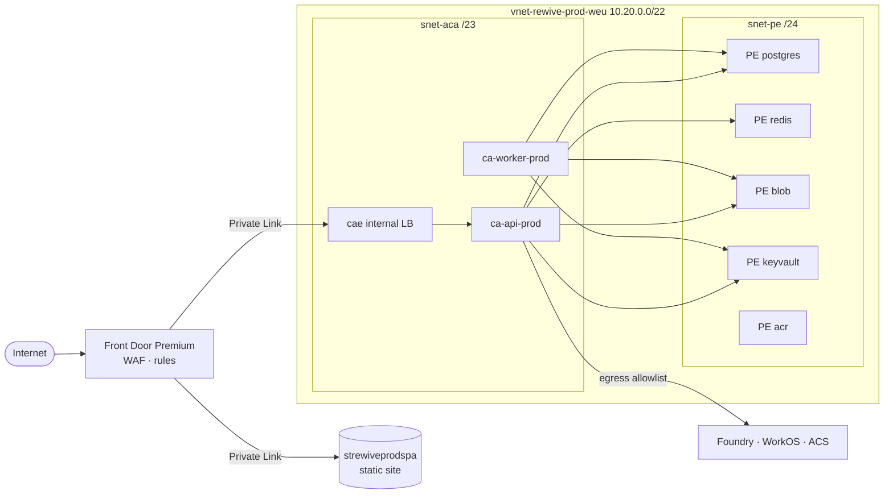

# ARCH-004 · Rewive on Azure — Low-Level Design

Resource-level configuration for the design in [[ARCH-003-azure-hld|ARCH-003]]:
naming, address plan, SKUs, app and database configuration, RBAC, pipeline,
alert rules, and operational runbooks.

Values shown are production (`prod` / West Europe); Entry 11 holds the
per-environment matrix.

> [!warning] Region and tenancy are superseded — the values below were never deployed
> This is the **July 2026 configuration**. A live estate exists and it is
> **East US 2**, not West Europe, so every `weu`/`neu` resource name here, the
> `10.20.0.0/22` address plan, and the North Europe DR target describe a
> deployment that was never built. The reasoning is in
> [[ARCH-003-azure-hld|ARCH-003]]'s supersession note; the short version is
> that Claude has zero Foundry availability in Middle East & Africa (ruling out
> UAE North) and the subscription has zero Postgres SKU capacity in East US.
>
> **Read this document for its structure, not its values.** The naming
> convention, network segmentation, SKU reasoning, RBAC model, alert rules,
> hardening checklist and runbooks are all still the best reference — and the
> deployed Terraform follows them closely, including `azurerm` as the IaC
> choice (AD-08).
>
> **Two specific corrections, so they are not copied forward:**
> - **Entry 09's smoke suite mandates an RLS cross-tenant leak test.** There is
>   no RLS. Isolation is a dedicated resource group and PostgreSQL server per
>   customer, so the equivalent check is that a customer's data is provisioned
>   into its own database by the control plane — not that a policy filtered it.
> - **Entry 04's Redis and the connection-pooling guidance are not in effect.**
>   Redis is gated off after repeated `InsufficientCapacity` allocation
>   failures, and PgBouncer is unsupported on the `Burstable B1ms` tier the
>   deployment uses — a General Purpose SKU plus `statement_cache_size=0` in
>   the app would be required first.
>
> **What is actually deployed** lives in the private repo
> `sanjuveed-debug/rewive-infra` (Terraform, `azurerm`), one reusable module
> invoked per customer. Its README records every failure found by a real
> `terraform apply` — treat it as more current than this document for anything
> operational.

---

## Entry 01 · Resource inventory & naming

CAF-style names: `<type>-rewive-<env>-<region>`, region codes `weu` / `neu`.
Globally-unique names (storage, ACR) drop hyphens. Every resource carries tags
`env`, `owner`, `cost-center`, `release`, enforced by Azure Policy on both
subscriptions.

| Resource | Name (prod) | SKU / tier |
|---|---|---|
| Resource group — core | `rg-rewive-prod-weu` | — |
| Resource group — edge (global) | `rg-rewive-prod-global` | — |
| Virtual network | `vnet-rewive-prod-weu` | `10.20.0.0/22` |
| Container Apps environment | `cae-rewive-prod-weu` | Workload profiles; internal-only |
| Container apps | `ca-api-prod` · `ca-worker-prod` · `job-migrate-prod` | Consumption profile |
| PostgreSQL Flexible Server | `psql-rewive-prod-weu` | `Standard_D2ds_v5`, PG 16, 128 GiB, zone-redundant HA |
| Azure Managed Redis | `redis-rewive-prod-weu` | Balanced B1 |
| Storage — app data | `strewiveprodweu` | StorageV2, GZRS, private |
| Storage — SPA origin | `strewiveprodspa` | StorageV2, LRS, static website |
| Key Vault | `kv-rewive-prod-weu` | Standard, RBAC mode, purge protection on |
| Container registry | `acrrewiveprod` | Standard |
| Front Door | `afd-rewive-prod` | Premium (Private Link origin) |
| WAF policy | `wafrewiveprod` | DRS 2.1 + Bot Manager, Prevention |
| DNS zone | `rewive.app` | Azure DNS public zone |
| Log Analytics | `log-rewive-prod-weu` | PerGB2018, 90-day retention |
| Application Insights | `appi-rewive-prod-weu` | Workspace-based |
| Managed identities | `id-api-prod` · `id-worker-prod` · `id-migrate-prod` · `id-cicd-prod` | User-assigned |
| Foundry resource | `fnd-rewive-prod` | Claude deployments — Entry 07 |
| Communication Services | `acs-rewive-prod` | Email, custom domain `mail.rewive.app` |

---

## Entry 02 · Network design

| Subnet | CIDR | Purpose · delegation |
|---|---|---|
| `snet-aca` | `10.20.0.0/23` | Container Apps environment infrastructure — delegated `Microsoft.App/environments` |
| `snet-pe` | `10.20.2.0/24` | Private endpoints: Postgres, Redis, Blob, Key Vault, ACR |
| `snet-mgmt` | `10.20.3.0/26` | Reserved: temporary ops runners (e.g. restore verification) |
| reserved | `10.20.3.64/26` … `/22` end | Future: read replicas, second ACA profile |

| Private DNS zone | Serves |
|---|---|
| `privatelink.postgres.database.azure.com` | `psql-rewive-prod-weu` |
| `privatelink.redis.azure.net` | `redis-rewive-prod-weu` |
| `privatelink.blob.core.windows.net` | `strewiveprodweu` |
| `privatelink.vaultcore.azure.net` | `kv-rewive-prod-weu` |
| `privatelink.azurecr.io` | `acrrewiveprod` |

All five are linked to `vnet-rewive-prod-weu`.

- **Ingress path (the only one)** — Internet → Front Door Premium → Private Link
  → ACA internal load balancer → `ca-api-prod`. The ACA environment has
  `internal: true`; there is no public IP on any origin. The SPA storage origin
  is public-network-disabled, with Front Door reaching it via Private Link too.
- **Egress allowlist** (NSG on `snet-aca` plus an audit alert on denies):
  Foundry endpoint, WorkOS, ACS SMTP, `api.anthropic.com` (fallback,
  flag-gated), Azure Monitor. Everything else denied.
- **Public network access = Disabled** on Postgres, Redis, both storage
  accounts, Key Vault, and ACR. CI reaches ACR through a Private Link-enabled
  runner or a temporary agent in `snet-mgmt`.



---

## Entry 03 · Compute — Container Apps

| Setting | `ca-api-prod` | `ca-worker-prod` | `job-migrate-prod` |
|---|---|---|---|
| Image | `acrrewiveprod.azurecr.io/rewive-api:<release>` | `…/rewive-worker:<release>` | `…/rewive-migrate:<release>` |
| CPU / memory | 0.5 vCPU / 1 GiB | 0.5 vCPU / 1 GiB | 0.25 vCPU / 0.5 GiB |
| Replicas | min 2 · max 10 | min 1 · max 3 | Manual-trigger job, 1 run per deploy |
| Scale rule | HTTP concurrency = 50 | KEDA `postgresql`: pending jobs > 100 | — |
| Ingress | Internal, HTTPS :3000, sticky off | None | None |
| Health probes | `/healthz` liveness · `/readyz` readiness (checks DB + Redis) | liveness `/healthz` (heartbeat file) | — |
| Identity | `id-api-prod` | `id-worker-prod` | `id-migrate-prod` |
| Revisions | Single-revision mode; deploy = new revision, auto-rollback on failed probes | same | — |

### Environment variables — `ca-api-prod`

| Variable | Value / source |
|---|---|
| `NODE_ENV` | `production` |
| `PORT` | `3000` |
| `DATABASE_URL` | Key Vault ref `kv:pg-connstring` — user `rewive_app` (no BYPASSRLS), `sslmode=require`, via PgBouncer port 6432 |
| `REDIS_URL` | Key Vault ref `kv:redis-connstring` |
| `STORAGE_ACCOUNT_URL` | `https://strewiveprodweu.blob.core.windows.net` — managed-identity auth, no key |
| `STORAGE_CONTAINER` | `attachments` |
| `OIDC_ISSUER` / `OIDC_CLIENT_ID` / `OIDC_AUDIENCE` | WorkOS values (SaaS) or tenant Entra ID (dedicated) |
| `TENANT_HOST_SUFFIX` | `.rewive.app` — tenant slug parsed from the Host header |
| `LLM_PROVIDER` / `LLM_MODEL` | `foundry` / `claude-sonnet-4-5` (fallback `anthropic` — Entry 07) |
| `FOUNDRY_ENDPOINT` / `FOUNDRY_API_KEY` | endpoint plain · key = Key Vault ref `kv:foundry-key` |
| `APPLICATIONINSIGHTS_CONNECTION_STRING` | from `appi-rewive-prod-weu` |
| `EMAIL_ENDPOINT` | ACS endpoint, managed-identity auth |

The worker takes the same set minus ingress and OIDC values, plus
`WORKER_CONCURRENCY=5` and `SLA_TICK_INTERVAL=60s`. The migration job takes only
`DATABASE_URL`, with a distinct secret `kv:pg-connstring-migrate` whose role
`rewive_migrate` owns the schema — the app role cannot `ALTER`.

---

## Entry 04 · Data — Postgres, Redis, Storage

### PostgreSQL Flexible Server

| Parameter | Value | Note |
|---|---|---|
| Version / compute | PG 16 · `Standard_D2ds_v5` | Online scale-up path to D4/D8 |
| Storage | 128 GiB, autogrow on | |
| HA | Zone-redundant, zones 1↔2 | Synchronous standby, auto failover |
| Backup | 35-day PITR, geo-redundant | Restore target: North Europe |
| Connection pooling | Built-in PgBouncer, transaction mode, port 6432 | App connects to 6432 only |
| Server params | `max_connections 200` · `log_min_duration_statement 500ms` · `azure.extensions pg_stat_statements,pgcrypto` | |
| Auth | Password auth for app roles (secrets in KV); Entra admin group `rewive-dba` for humans | Entra token auth for apps is a hardening follow-up |
| Databases / roles | `rewive` · roles `rewive_app` (RLS-bound), `rewive_migrate` (DDL), `rewive_readonly` (support, RLS-bound) | No role has `BYPASSRLS` except the postgres admin |

Tenancy enforcement, applied by migration and asserted by a CI leak test on
every deploy:

```sql
ALTER TABLE findings ENABLE ROW LEVEL SECURITY;
ALTER TABLE findings FORCE ROW LEVEL SECURITY;   -- applies to the table owner too

CREATE POLICY tenant_isolation ON findings
  USING (tenant_id = current_setting('app.tenant_id')::uuid);

-- API middleware, once per request-transaction:
--   SET LOCAL app.tenant_id = '<uuid from resolved tenant>';
-- SET LOCAL scopes the setting to the transaction — safe with PgBouncer
-- transaction pooling (no session-level state leaks between tenants).
```

### Managed Redis & Storage

| Resource | Configuration |
|---|---|
| `redis-rewive-prod-weu` | Balanced B1 · zone-redundant · TLS only · private endpoint · `maxmemory-policy allkeys-lru`. Cache is disposable by design; nothing durable in Redis (R-02) |
| `strewiveprodweu` | Containers: `attachments` (private), `exports` (private, 30-day lifecycle delete), `db-dumps` (nightly logical backups, 90-day retention, legal-hold capable). Versioning + soft delete 14 d. SAS: user-delegation, ≤ 15 min, issued by the API only |
| `strewiveprodspa` | Static website; per-release folder `/releases/<version>/`; `index.html` no-cache, hashed assets `max-age=31536000, immutable` |

---

## Entry 05 · Edge — Front Door, WAF, DNS

| Item | Configuration |
|---|---|
| Endpoints / domains | `app.rewive.app` + wildcard `*.rewive.app` (tenant subdomains) — AFD-managed certs, TXT-validated; apex `rewive.app` hosts the marketing site as a separate route |
| Origin group — API | ACA internal LB via **Private Link**; health probe `GET /healthz` every 30 s; session affinity off |
| Origin group — SPA | `strewiveprodspa` static site via Private Link |
| Routes | `/api/*` → API origin, no caching, Host header forwarded unchanged (tenant resolution depends on it) · `/*` → SPA origin, caching and compression on |
| Rules engine | HTTP→HTTPS redirect · HSTS `max-age=63072000; includeSubDomains; preload` · security headers (CSP, X-Content-Type-Options, Referrer-Policy) · SPA fallback: non-asset 404 → `/index.html` rewrite |
| WAF `wafrewiveprod` | Prevention mode · DRS 2.1 managed rules · Bot Manager 1.0 · custom rule: rate limit 300 req/min per IP on `/api/*` · geo-block list empty by default (per-contract option) · logs to Log Analytics |
| DNS (`rewive.app`) | `app`, `*` → AFD endpoint · apex ALIAS → AFD · `mail` → ACS (SPF, DKIM, DMARC per ACS onboarding) · CAA records for the issuing CA |

> [!tip] Dev/staging economy (AD-02)
> Staging runs Front Door **Standard**: ACA ingress is public but pinned — an
> ACA IP restriction to the `AzureFrontDoor.Backend` service tag plus middleware
> validation of the `X-Azure-FDID` header against the known Front Door ID. Dev
> skips Front Door entirely and hits ACA's public ingress over HTTPS.

---

## Entry 06 · Identity & RBAC

| Identity | Role | Scope |
|---|---|---|
| `id-api-prod` | Key Vault Secrets User | `kv-rewive-prod-weu` |
| | Storage Blob Data Contributor | `strewiveprodweu` — `attachments`, `exports` containers only |
| | AcrPull | `acrrewiveprod` |
| | Azure AI User (Foundry inference) | `fnd-rewive-prod` |
| `id-worker-prod` | As API, plus Communication Services Email Sender | KV · Storage · ACR · Foundry · ACS |
| `id-migrate-prod` | Key Vault Secrets User · AcrPull | KV (migrate connstring only, via RBAC condition) · ACR |
| `id-cicd-prod` *(federated to GitHub `rewive/rewive-front-end`, environment `prod`)* | Contributor | `rg-rewive-prod-weu`, `rg-rewive-prod-global` |
| | AcrPush | `acrrewiveprod` |
| | Storage Blob Data Contributor | `strewiveprodspa` (SPA upload) |
| Group `rewive-dba` | Entra admin on Postgres | Break-glass, PIM-activated, MFA |
| Group `rewive-ops` | Reader + Monitoring Reader | Both prod RGs; PIM elevation to Contributor for incidents |

### OIDC configuration (user auth)

- **Pooled SaaS** — WorkOS: one organization per tenant, a connection per
  customer IdP. The API validates WorkOS-issued JWTs (issuer, audience,
  `org_id → tenant_id` mapping held in the tenants table).
- **Dedicated (Entra ID)** — two app registrations: `rewive-spa` (public client,
  auth-code + PKCE, redirect `https://<tenant>.rewive.app/auth/callback`) and
  `rewive-api` (exposes scope `api://rewive/access`). Group-claim → role mapping
  in app config. Same abstraction, different issuer values (Entry 03).

What those roles *mean* inside a tenant is specified in
[[PROD-001-access-control|PROD-001]], not here.

---

## Entry 07 · LLM — Foundry configuration

| Item | Configuration |
|---|---|
| Resource | `fnd-rewive-prod` (Microsoft Foundry), West Europe or the closest Claude-served region — confirm model-region availability at provisioning |
| Deployments | `claude-sonnet-4-5` for summaries and drafting · `claude-haiku-4-5` for classification and triage assists. Revisit quarterly as Foundry adds newer Claude models |
| Auth | Managed identity (Azure AI User) preferred; API key in `kv:foundry-key` only if an SDK path requires it |
| Gateway config | `LLM_PROVIDER=foundry`; per-tenant budgets (tokens/day) and rate limits enforced in the gateway; usage rows written per call: `tenant_id, feature, model, tokens_in, tokens_out, latency` |
| Fallback | `LLM_PROVIDER=anthropic` + `kv:anthropic-key`; flag-gated, requires the egress rule to `api.anthropic.com`. Staging exercises the fallback path quarterly ([[ARCH-003-azure-hld\|ARCH-003]] risk R-2) |
| Data terms | Inference only, no training on inputs; prompts include minimum tenant context; tenant-level kill switch `features.llm=false` |
| Guardrails | Timeout 30 s, retry ×2 with backoff, circuit-breaker per tenant. An LLM outage degrades features, never blocks the SLA engine |

---

## Entry 08 · Observability & alerting

All logs and metrics land in `log-rewive-prod-weu`; traces via App Insights
(OpenTelemetry Node SDK, 20% sampling, 100% for errors). Structured JSON logs
carry `tenant_id`, `request_id`, and `release`. Two workbooks: *Service health*
(latency, errors, saturation) and *SLA engine* (queue depth, overdue clocks,
escalations fired, LLM spend by tenant).

| Alert | Condition | Severity → action |
|---|---|---|
| API availability | AFD origin health < 100% for 5 min, or 5xx rate > 2% over 5 min | **Sev 1** page on-call |
| Latency | p95 `/api` > 800 ms over 10 min | Sev 2 notify |
| Worker heartbeat | No `worker.tick` custom metric for 5 min | **Sev 1** page — SLA engine stalled |
| Queue lag | Oldest pending job > 120 s for 10 min | Sev 2 |
| Postgres | CPU > 80% (15 min) · storage > 80% · connections > 80% of max · failover event | Sev 2 (failover: Sev 1 info) |
| Redis | Memory > 90% · eviction spike | Sev 3 |
| WAF | Blocked requests > 1000 / 5 min (attack signal) | Sev 2 |
| Deploy | Migration job failed, or a new revision failed probes (auto-rollback fired) | **Sev 1** to release channel |
| Cost | Subscription budget 80% / 100% forecast · LLM tenant budget exceeded | Sev 3 finance + product |
| Security | KV access denies · NSG egress denies · Defender for Cloud recommendations ≥ High | Sev 2 security channel |

The worker-heartbeat query behind the Sev 1 alert:

```kusto
customMetrics
| where name == "worker.tick"
| summarize last_tick = max(timestamp)
| extend stalled = last_tick < ago(5m)
| where stalled
```

---

## Entry 09 · CI/CD & IaC layout

GitHub Actions with OIDC federation (no stored cloud credentials). One pipeline,
three GitHub environments (`dev`, `staging`, `prod`) with protection rules; prod
requires approval. Terraform state lives in a dedicated `strewivetfstate`
account (versioned, RA-GZRS) with per-environment state files.

```
infra/
  modules/azure/          # network.tf frontdoor.tf aca.tf postgres.tf redis.tf
                          # storage.tf keyvault.tf identity.tf monitor.tf foundry.tf
  envs/
    dev.tfvars  staging.tfvars  prod.tfvars
.github/workflows/
  deploy.yml
```

```yaml
# deploy.yml — the shape (abridged)
jobs:
  build:
    steps:
      - run: npm ci && npm run lint && npm test && npm run build
      - run: docker build -t $ACR/rewive-api:$SHA -f docker/api.Dockerfile .
      - uses: azure/login@v2            # OIDC federation → id-cicd-<env>
      - run: az acr login -n acrrewiveprod && docker push $ACR/rewive-api:$SHA
  infra:
    needs: build
    steps:
      - run: terraform -chdir=infra plan  -var-file=envs/${{ env }}.tfvars -out=tfplan
      - run: terraform -chdir=infra apply tfplan
  release:
    needs: infra
    steps:
      - run: az containerapp job start -n job-migrate-${{ env }} --image $ACR/rewive-migrate:$SHA
      - run: az containerapp job show ...   # wait; FAIL PIPELINE if migration fails
      - run: az containerapp update -n ca-api-${{ env }}    --image $ACR/rewive-api:$SHA
      - run: az containerapp update -n ca-worker-${{ env }} --image $ACR/rewive-worker:$SHA
      - run: az storage blob upload-batch -d '$web' -s dist/    # SPA, then purge AFD cache
      - run: npm run smoke -- --base https://app.rewive.app     # incl. cross-tenant leak test
```

- **Order matters** — migrations run and succeed *before* new app revisions
  roll. Schema changes stay backwards-compatible for one release so old
  revisions keep working mid-deploy (release-train rule from
  [[ARCH-001-productization-strategy|ARCH-001]] Entry 05).
- **Rollback** — ACA keeps the previous revision;
  `az containerapp revision activate` restores it in seconds. Migrations are
  never rolled back (forward-fix only).
- **The smoke suite always includes the RLS leak test** — create two tenants,
  assert zero cross-visibility. This is the standing mitigation for
  [[ARCH-003-azure-hld|ARCH-003]] risk R-3.

---

## Entry 10 · Runbooks

### RB-1 · First-time provisioning

1. Bootstrap: create `strewivetfstate` and the backend config; create the two
   Entra groups; register resource providers.
2. Create `id-cicd-<env>` and its GitHub OIDC federation (repo + environment
   claims); assign roles per Entry 06.
3. `terraform apply` for the environment — network → data → compute → edge order
   is dependency-resolved by the module.
4. Delegate `rewive.app` NS records to Azure DNS; approve AFD domain validation
   (TXT).
5. Seed Key Vault: `pg-connstring`, `pg-connstring-migrate`, `redis-connstring`,
   `workos-*`, `foundry-key` (if used), `anthropic-key` (optional).
6. Create Foundry model deployments (Entry 07); confirm region availability.
7. Run the pipeline once on `main` — verifies build, migrate, deploy, and smoke
   end to end.
8. Enable alerts and budgets; run the RLS leak test manually once; record
   baseline latencies in the ops log.

### RB-2 · Routine deploy

Merge to `main` → dev auto-deploys → cut release tag → staging deploys and runs
full regression → approval gate → prod. Any migration-job failure stops the
train before app rollout; any probe failure auto-rolls back the revision and
pages.

### RB-3 · Regional DR restore *(target RTO 4 h — rehearse quarterly, timed)*

1. Declare the incident; freeze deploys; note the last-known-good timestamp.
2. `terraform apply -var-file=envs/prod-dr.tfvars` — provisions the North Europe
   copy (pre-written tfvars; edge and DNS are global and unchanged).
3. Geo-restore Postgres to `psql-rewive-dr-neu` at the chosen point in time;
   verify with the restore-check script (row counts, latest ledger entries,
   queue table state).
4. Update Key Vault connection strings (DR vault); roll API and worker revisions
   in the DR environment.
5. Swap Front Door origin groups to the DR origins; confirm health probes green.
6. Worker resumes SLA clocks from restored queue state — verify overdue
   escalations fire exactly once (idempotency keys).
7. Communicate, monitor, and plan fail-back as a normal migration.

### RB-4 · Tenant offboarding (GDPR erasure)

1. Flag the tenant `status=offboarding` — blocks logins, stops schedulers.
2. Export on request: the worker writes a full tenant export to `exports/`, a
   SAS link is delivered, 30-day lifecycle delete applies.
3. Worker job: RLS-scoped hard delete across all tables plus blob prefix purge.
   The job record is retained as the auditable erasure certificate.
4. Note: erased data persists in PITR and backup media until retention windows
   lapse (≤ 35 d / 90 d) — state this in the DPA.

---

## Entry 11 · Environment matrix

| Parameter | prod | staging | dev |
|---|---|---|---|
| Front Door | Premium + Private Link | Standard + FDID pinning | none (public ACA ingress) |
| ACA env | internal · workload profiles | public · consumption | public · consumption |
| API replicas | 2–10 | 1–3 | 0–2 (scale to zero) |
| Postgres | D2ds_v5 · ZR-HA · PITR 35 d · geo-backup | D2ds_v5 · no HA · PITR 7 d | B1ms burstable · PITR 7 d |
| Redis | Balanced B1 · ZR | Balanced B0 | none (in-app cache) |
| Private endpoints | all services | Postgres only | none (firewall rules) |
| Log retention | 90 d | 30 d | 30 d |
| App Insights sampling | 20% (errors 100%) | 50% | 100% |
| LLM budget | per-tenant metering | hard cap | hard cap, Haiku only |
| Domain | `*.rewive.app` | `*.stg.rewive.app` | `*.dev.rewive.app` |
| Deploy trigger | tag + approval | release tag | every merge to main |

---

## Entry 12 · Hardening checklist (pre-go-live gate)

- [ ] Public network access disabled on Postgres, Redis, Storage (app), Key Vault, and ACR — verified by Azure Policy audit, not by hand
- [ ] No secrets in app config, pipeline, or repo — Key Vault references and managed identities only; secret scanning enabled in GitHub
- [ ] `rewive_app` role: no `BYPASSRLS`, no DDL; `FORCE RLS` on every tenant table; CI leak test green
- [ ] WAF in Prevention (not Detection) with DRS 2.1 and bot rules; rate-limit rule tested
- [ ] HSTS preload, CSP, and security headers verified on `app.rewive.app` and one tenant subdomain
- [ ] PIM required for all standing prod access; break-glass account tested and alarmed
- [ ] Defender for Cloud plans on for ACA, Postgres, Storage, Key Vault; zero unresolved High recommendations
- [ ] Diagnostic settings on every resource → Log Analytics; 90-day retention confirmed
- [ ] DR runbook RB-3 executed once end to end with timing recorded (< 4 h)
- [ ] Backup restore verified monthly by an automated restore-check job, not just backup-success alerts
- [ ] Budget alerts live on both subscriptions; LLM per-tenant caps enforced in the gateway
- [ ] Pen test / external scan booked before the first paying tenant
