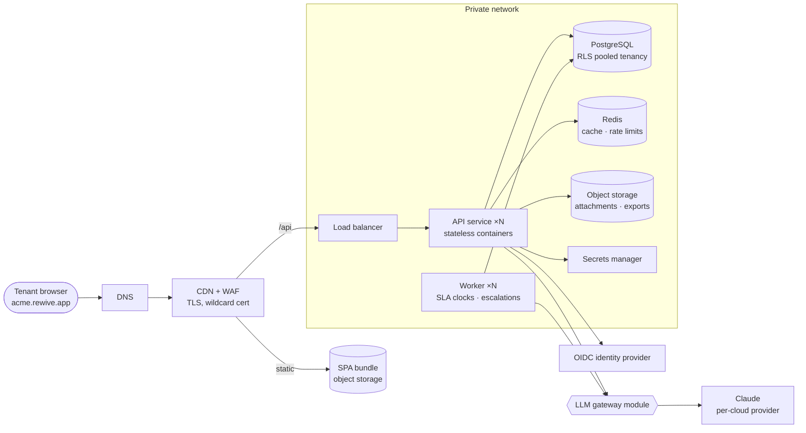
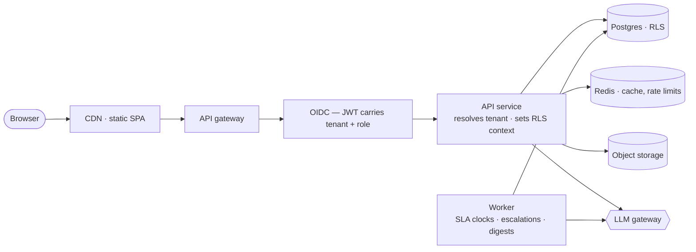
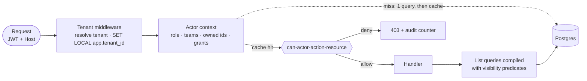
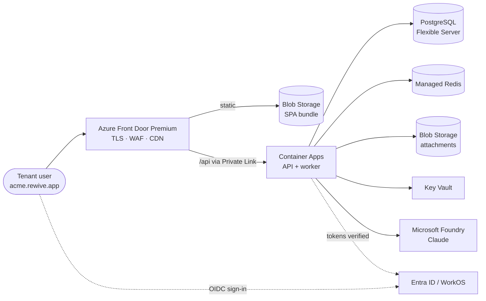
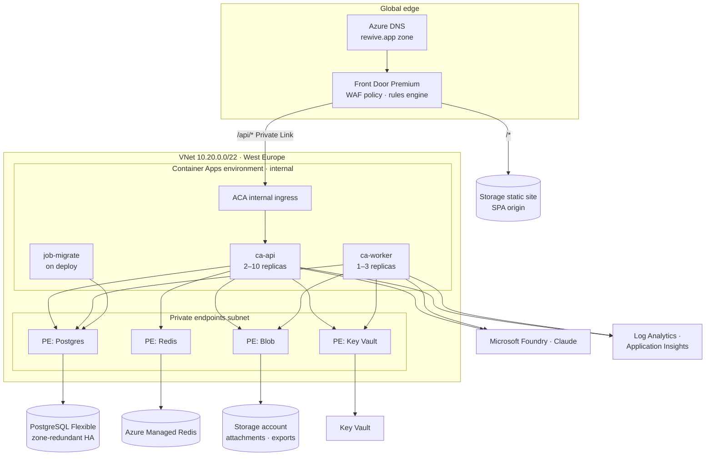
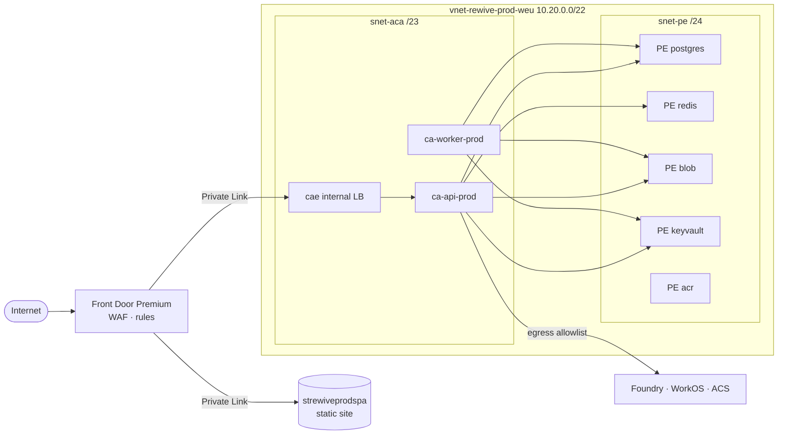
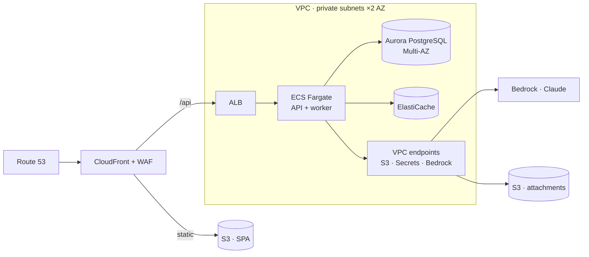
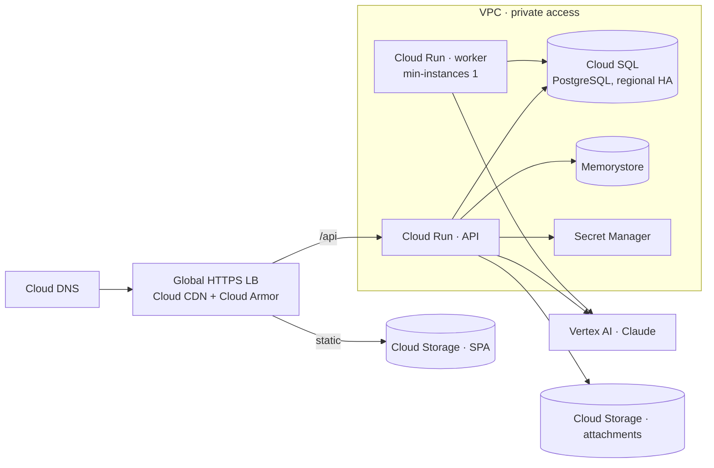
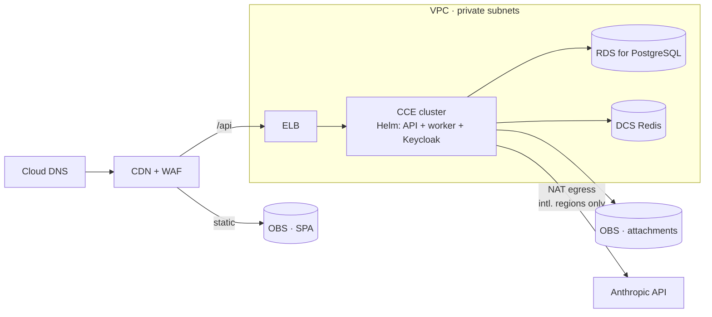

# Visual walkthrough — every architecture and flow diagram

Every diagram from the architecture and product documents, in one place, ordered
as a narrative rather than by document number: what the system *is*, how a
request moves through it, who is allowed to see what, how it lands on Azure, and
what changes on the other clouds.

> [!important] This is a derived view
> Every diagram here is copied from a numbered document, which remains the
> source of truth. **Edit the diagram in its source document, then update it
> here** — never the other way round. Each section names its source.

## Contents

| # | Diagram | Source |
|---|---|---|
| 0 | How to read these diagrams | — |
| 1 | The system in one picture | [[ARCH-002-multi-cloud-hosting\|ARCH-002]] Entry 02 |
| 2 | How a request flows | [[ARCH-001-productization-strategy\|ARCH-001]] Entry 03 |
| 3 | Who is allowed to see what | [[PROD-001-access-control\|PROD-001]] Entry 05 |
| 4 | Azure — context | [[ARCH-003-azure-hld\|ARCH-003]] Entry 02 |
| 5 | Azure — components | [[ARCH-003-azure-hld\|ARCH-003]] Entry 04 |
| 6 | Azure — network and traffic | [[ARCH-004-azure-lld\|ARCH-004]] Entry 02 |
| 7 | AWS | [[ARCH-002-multi-cloud-hosting\|ARCH-002]] Entry 03 |
| 8 | Google Cloud | [[ARCH-002-multi-cloud-hosting\|ARCH-002]] Entry 05 |
| 9 | Huawei Cloud | [[ARCH-002-multi-cloud-hosting\|ARCH-002]] Entry 06 |

---

## 0 · How to read these diagrams

The same shapes mean the same things throughout:

| Shape | Meaning | Example |
|---|---|---|
| `([ rounded ])` | A person or external actor | Tenant browser |
| `[ rectangle ]` | A running service or component | API service, worker |
| `[( cylinder )]` | A datastore | PostgreSQL, object storage |
| `{{ hexagon }}` | An internal module, not a deployed service | LLM gateway, policy module |
| `subgraph box` | A trust or network boundary | VPC, VNet, private subnets |
| Dotted arrow | An out-of-band or verification path | Token verification |

Two things recur in every topology and are worth watching for, because they are
the load-bearing decisions:

- **The worker is always separate from the API.** It owns SLA clocks and
  escalations. Rewive's promise — *nothing drifts unanswered* — is only as
  reliable as this component.
- **The queue lives inside PostgreSQL**, not in a separate broker. That is why
  the database restore point is also the escalation-state restore point.

---

## 1 · The system in one picture

*Source: ARCH-002 Entry 02 — the portable reference architecture.*

Cloud-agnostic. Every provider mapping later in this document is this diagram
with vendor names substituted.

**What to notice:** only four things are stateful — Postgres, Redis, object
storage, and the secrets manager. Everything else is a replaceable container.
That is the entire reason a fifth cloud is a two-week exercise.

---

## 2 · How a request flows

*Source: ARCH-001 Entry 03.*

The path from browser to database, and where tenant isolation is established.

**What to notice:** the tenant is established *once*, early, by middleware that
sets `app.tenant_id` on the transaction. Everything downstream is filtered by
row-level security in the database. No application query names another tenant's
rows, so isolation does not depend on any developer remembering to add a
`WHERE` clause.

---

## 3 · Who is allowed to see what

*Source: PROD-001 Entry 05 — authorization evaluation.*

Tenant isolation (above) answers *which company's data exists for you*. This
answers *what you may do inside it* — a separate, application-layer concern.

**What to notice:** two distinct outputs from one policy module. Point decisions
("may this actor close this finding?") return allow or deny. List queries get
compiled into SQL predicates instead — filtering after the query would corrupt
pagination and counts, and the Today queue's numbers have to be honest.

---

## 4 · Azure — context

*Source: ARCH-003 Entry 02.*

The same reference architecture, with Azure services named.

**What to notice:** the user authenticates directly against the identity
provider; the API only ever *verifies* the resulting token. Rewive never handles
a password.

---

## 5 · Azure — components

*Source: ARCH-003 Entry 04.*

Production detail: replica counts, the private-endpoint layer, and the
deployment-time migration job.

**What to notice:** `job-migrate` reaches Postgres but nothing else, and runs
under its own identity with a database role that can `ALTER`. The API's role
cannot. Schema changes and request handling are separated by credential, not by
convention.

---

## 6 · Azure — network and traffic

*Source: ARCH-004 Entry 02.*

The security-review diagram: every route in and out.

**What to notice:** there is exactly one arrow from the internet into the
system, and it terminates at Front Door. The Container Apps environment is
internal-only; Postgres, Redis, Blob, Key Vault, and ACR have public network
access disabled entirely. Egress is an allowlist, not a default-open route.

---

## 7 · AWS

*Source: ARCH-002 Entry 03. The recommended pooled-SaaS home cloud.*

**What to notice:** Claude is reached through a VPC endpoint, so inference
traffic never traverses the public internet. This is the strongest version of
the LLM story in a security review, and the main reason AWS is the default
recommendation.

---

## 8 · Google Cloud

*Source: ARCH-002 Entry 05. The leanest serverless expression.*

**What to notice:** the worker is pinned to `min-instances 1`. Cloud Run
throttles CPU on idle instances, which would silently stall SLA clocks — the one
place where a serverless default actively breaks the product promise.

---

## 9 · Huawei Cloud

*Source: ARCH-002 Entry 06. Dedicated deployments only, never a pooled-SaaS home.*

**What to notice:** two differences from every other mapping. Keycloak ships
*inside* the cluster, because there is no managed customer-IdP equivalent. And
the Anthropic arrow is conditional — it exists in international regions only.
In mainland-China regions LLM features are flagged off entirely, and the
deterministic SLA and escalation core is what gets sold.
