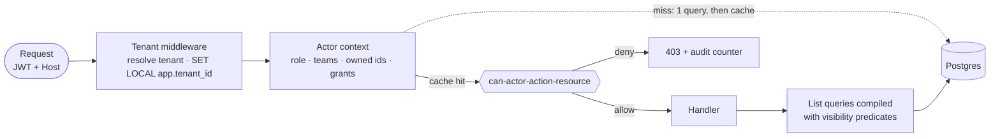

# PROD-001 · In-product access control

Who may see and do what inside a Rewive tenant — the role model, how permissions
are stored, how every read and write is evaluated, and how changes are managed,
propagated, and audited.

Infrastructure is out of scope by design: the platform
([[ARCH-003-azure-hld|ARCH-003]] Entry 06) guarantees authentication and tenant
isolation; everything below is application-layer product behavior.

---

## Entry 01 · Principles & boundary

Access control in Rewive is a product feature because accountability *is* the
product: who owns a mandate, who may close a finding, who can record a decision
are things customers configure, see, and pay for.

- **Deny by default.** Every action requires an explicit capability; an
  unmatched request is refused, never "probably fine".
- **One policy module.** A single `can(actor, action, resource)` function is the
  only place authorization logic lives. API routes, the worker, exports, and the
  LLM gateway all call it. No inline role checks, ever.
- **Grants live in the database, not the token.** The JWT stays thin (subject,
  tenant, coarse role hint). Effective permissions are read from Postgres so a
  change takes effect in seconds, without waiting for token expiry.
- **Every permission change is a ledger event.** Rewive's own idiom applied to
  itself: role changes, transfers, and grants are recorded, attributable, and
  reviewable.
- **The platform boundary stays clean.** Tenant isolation (RLS on `tenant_id`)
  is the security boundary and changes rarely. In-tenant permissions sit above
  it and iterate freely — a product bug here is an incident, but never a
  cross-tenant breach.

---

## Entry 02 · Actors, roles & scopes

| Role | Intent | Typical holder |
|---|---|---|
| **Admin** | Runs the tenant: members, teams, integrations, tenant settings, all lenses | Ops lead, IT owner |
| **Operator** | Does the work: sees their teams' findings, acts on what they own or are assigned | Managers, analysts — most seats |
| **Viewer** | Reads rollups: Operating Picture and ledger summaries; no threads, no actions | Executives, adjacent teams |
| **Auditor** | Reads everything, changes nothing; bulk export rights; every read logged | Compliance, internal audit |
| **Agent** *(machine actor)* | Integration or AI actor with a named, narrow capability set | Connectors, automations |

Two scoping dimensions refine what a role reaches. They are data, not new roles:

- **Team membership** — operators see and touch the findings, mandates, and
  threads of teams they belong to. Teams are the visibility unit.
- **Ownership** — a mandate or finding has exactly one accountable owner (plus an
  optional deputy). Certain actions are owner-only regardless of role: closing
  the loop is the accountability moment, and the model enforces it.

Time-boxed **exception grants** (Entry 04) cover the rest — "let this operator
see that team's mandate for two weeks" — without inventing roles.

> [!note] Deliberately not in v1
> Custom roles, per-field permissions, and attribute-based rules. The four human
> roles plus scoping cover every design-partner scenario named so far; custom
> roles arrive as an enterprise-tier feature (Entry 09) built as named capability
> bundles over this same model — nothing below has to change.

---

## Entry 03 · Permission matrix

`✓` allowed · `own` = only for resources the actor owns or deputizes ·
`team` = within the actor's teams · `—` denied.

This table is the normative spec; it ships in code as a table-driven test suite,
so the matrix and the product cannot drift apart.

| Action | Admin | Operator | Viewer | Auditor | Agent |
|---|---|---|---|---|---|
| Operating Picture (rollups) | ✓ | team | ✓ | ✓ | — |
| Today queue | ✓ | team | — | ✓ | — |
| Read finding threads | ✓ | team | — | ✓ | per grant |
| Read Decision Ledger | ✓ | team | summaries | ✓ | — |
| Create finding | ✓ | team | — | — | per grant |
| Comment / update thread | ✓ | team | — | — | per grant |
| Assign / reassign finding | ✓ | own | — | — | — |
| Extend SLA / snooze clock | ✓ | own | — | — | — |
| Close finding *("the number is back")* | — | own | — | — | — |
| Record decision (ledger write) | ✓ | own | — | — | — |
| Transfer mandate ownership | ✓ | own | — | — | — |
| Manage teams & members | ✓ | — | — | — | — |
| Manage integrations / agents | ✓ | — | — | — | — |
| Bulk export | ✓ | — | — | ✓ *(logged)* | — |
| Tenant settings / branding | ✓ | — | — | — | — |

> [!important] The one deliberate asymmetry
> Admins can do almost everything **except close a finding or answer for a
> mandate they don't own**. An admin who needs a stuck finding closed reassigns
> it to themselves first — which is a ledger event. Accountability can be
> **transferred, never bypassed**. This single rule is the product's positioning
> ("every mandate, held twice") expressed in the permission system, and it must
> survive every future redesign.

---

## Entry 04 · Storage — the schema

Five tenant-scoped tables carry the whole model. All sit under the platform's
RLS tenant boundary; none require new RLS policies of their own.

Ownership lives on the domain rows (`mandates.owner_member_id`), not in a
parallel permissions store — the accountable owner is domain data Rewive already
renders, so the permission system reads the same columns the UI does. One source
of truth, nothing to sync.

```sql
CREATE TABLE members (            -- a user's standing in this tenant
  tenant_id   uuid NOT NULL,
  id          uuid NOT NULL DEFAULT gen_random_uuid(),
  user_id     uuid NOT NULL,      -- IdP subject
  role        text NOT NULL CHECK (role IN ('admin','operator','viewer','auditor')),
  status      text NOT NULL DEFAULT 'invited'
              CHECK (status IN ('invited','active','suspended','removed')),
  created_at  timestamptz NOT NULL DEFAULT now(),
  PRIMARY KEY (tenant_id, id),
  UNIQUE (tenant_id, user_id)
);

CREATE TABLE teams (
  tenant_id uuid NOT NULL, id uuid NOT NULL DEFAULT gen_random_uuid(),
  name text NOT NULL,
  PRIMARY KEY (tenant_id, id)
);

CREATE TABLE team_members (
  tenant_id uuid NOT NULL, team_id uuid NOT NULL, member_id uuid NOT NULL,
  PRIMARY KEY (tenant_id, team_id, member_id)
);

-- Ownership is domain data on the resource itself:
--   mandates.owner_member_id, mandates.deputy_member_id  (deputy nullable)
--   findings.assignee_member_id, findings.team_id

CREATE TABLE grants (             -- time-boxed exceptions, not the norm
  tenant_id     uuid NOT NULL, id uuid NOT NULL DEFAULT gen_random_uuid(),
  member_id     uuid,            -- exactly one of member_id / agent_id is set
  agent_id      uuid,
  capability    text NOT NULL,   -- e.g. 'finding.read', 'finding.create'
  resource_type text NOT NULL,   -- 'team' | 'mandate' | 'finding'
  resource_id   uuid NOT NULL,
  granted_by    uuid NOT NULL,   -- member id of the admin
  reason        text,
  expires_at    timestamptz,     -- NULL = until revoked; default UI offers 14 d
  revoked_at    timestamptz,
  PRIMARY KEY (tenant_id, id)
);

CREATE TABLE agents (             -- machine actors: connectors, automations
  tenant_id uuid NOT NULL, id uuid NOT NULL DEFAULT gen_random_uuid(),
  name text NOT NULL,
  key_hash text NOT NULL,        -- API key stored hashed; shown once at creation
  capabilities text[] NOT NULL,  -- narrow, named at creation
  status text NOT NULL DEFAULT 'active',
  last_used_at timestamptz,
  PRIMARY KEY (tenant_id, id)
);
```

Plus one bookkeeping column on `tenants`: `permissions_version bigint`, bumped on
every write to these tables and the key to cache invalidation (Entry 05).
Indexes: `team_members(tenant_id, member_id)` and a partial index on active,
unexpired grants; both paths are single-digit-millisecond lookups at any
realistic tenant size.

---

## Entry 05 · Read path — how every request is evaluated



- **Actor context, assembled once per request.** After tenant resolution,
  middleware loads `{ member, role, status, team_ids, owned_mandate_ids,
  active_grants }` — one indexed query on a cache miss. Cached in Redis under
  `authz:{tenant}:{member}:{permissions_version}`: because the version is in the
  key, any permission change makes every stale entry unreachable instantly. No
  TTL tuning, no explicit invalidation fan-out; Redis LRU sweeps dead keys.
- **Point decisions.** `can(ctx, action, resource)` is a pure, synchronous
  function over that context — the matrix from Entry 03 in code. Pure means
  exhaustively unit-testable: CI runs every cell of the matrix plus the edge
  rules of Entry 08 on every commit.
- **List queries scope in SQL, not post-filter.** The policy module also
  compiles visibility predicates — for an operator,
  `findings WHERE team_id = ANY(:team_ids) OR assignee_member_id = :me`, with
  grants unioned in. Filtering after the query would corrupt pagination and
  counts; predicates keep the Today queue's numbers honest.
- **Non-HTTP callers use the same module.** The worker checks the *owner's*
  capabilities before acting on their behalf (an escalation email renders only
  what its recipient may see); the export pipeline scopes by the requesting
  auditor; the LLM gateway builds prompts only from rows the requesting actor
  could read — the policy layer is also the anti-leak boundary for AI features.
- **Fail closed.** Redis down → fall through to Postgres. Context row missing or
  status ≠ active → 403. Unknown action string → 403 and an error log, never a
  pass-through.

---

## Entry 06 · Update path — how permissions are managed

All changes go through the Members & Teams surface (admin-only) or the mandate
header (owner transfer). Every write is a transaction: mutate the table, bump
`permissions_version`, append the audit event — so a change, its propagation
trigger, and its paper trail are atomic. Effect is near-immediate (the next
request misses the cache); no JWT re-issue is ever needed because tokens are
thin.

| Flow | Behavior |
|---|---|
| Invite member | Admin enters email + role + teams → `members` row (`invited`) → mail with sign-in link → first OIDC login flips to `active`. Unaccepted invites expire in 14 days. |
| Change role | Immediate on the next request. Downgrading an operator who owns mandates is blocked until those mandates are transferred (Entry 08) — the UI opens the transfer flow inline. |
| Team changes | Add/remove membership; removal instantly narrows visibility. In-flight assignments to that member surface in a "needs reassignment" list rather than silently vanishing. |
| Transfer mandate | A first-class product moment, not an edit: requires a named recipient, writes a ledger entry ("mandate M transferred from A to B by C"), notifies both parties, and leaves SLA clocks untouched — accountability moves, deadlines don't. |
| Exception grant | Admin grants a capability on a team/mandate/finding; default expiry 14 days, reason required. Expiry is enforced at read time, so a lapsed grant needs no cleanup job to stop working. |
| Suspend / remove | Suspend: immediate 403 everywhere, plus a session-revocation check at the auth layer. Remove: suspend plus the reassignment wizard for anything they own; the member row is kept (status `removed`) so history stays attributable. |
| SSO group mapping | Optional per tenant: map IdP groups → roles and teams, applied at each login (the IdP wins while mapping is on; manual edits to mapped fields are disabled to prevent silent drift). This is how enterprise customers manage Rewive access from their directory without SCIM. |
| Agents | Created by admins with named capabilities; key shown once, stored hashed; rotation is create-new-then-revoke-old; `last_used_at` surfaces stale keys. |

---

## Entry 07 · Audit & the ledger

- **`permission_events`** — append-only: actor, event type, target, before →
  after, reason, timestamp. No updates, no deletes; tenant deletion is the only
  eraser.
- **Surfaced in-product** under Settings → Access history, filterable by member,
  so an admin can answer "who could see this in March?" without a support
  ticket. Accountability products don't get to have opaque permission histories.
- **Auditor reads are themselves events.** Bulk exports and auditor thread-reads
  log actor, scope, and time — the audit function is auditable.
- **Exportable** (CSV/JSON) by admins and auditors — the artifact enterprise
  security questionnaires ask for. A SIEM webhook is an enterprise-tier
  follow-up, not v1.
- **Support access is a grant, not a backdoor.** Rewive staff have zero standing
  access to tenant data. A support session requires the tenant admin to issue a
  time-boxed impersonation grant (default 24 h); the session is visibly badged
  in-app and every action lands in `permission_events`.

---

## Entry 08 · Edge cases & product rules

| Rule | Behavior |
|---|---|
| Last admin | The final active admin cannot be downgraded, suspended, or removed — promote a successor first. Enforced in the policy module, not just the UI. |
| No orphaned mandates | Any operation that would leave a mandate ownerless (removal, downgrade, team change) is blocked until ownership is transferred. "Nothing drifts unanswered" applies to the permission system itself. |
| Owner unavailable | The deputy holds owner capabilities while the owner is suspended or out (product-level out-of-office). Deputy actions are ledger-attributed as deputy — the record shows who actually acted. |
| Self-demotion | Admins may downgrade themselves (subject to last-admin), with an explicit confirmation naming what they lose. |
| Cross-team escalation | An escalation may route to a recipient outside the finding's team; delivery auto-creates a scoped, expiring read grant on that finding. Escalations must never be blocked by visibility, and the grant makes the access explicit instead of implicit. |
| Viewer ceilings | Viewers see aggregates with counts, not titles, for teams they're not cleared for. Rollup queries run through the same predicate compiler, so a "summary" can never leak a restricted row's existence via its name. |
| Concurrent change | Permissions load per request; a revocation mid-session takes effect on the next request (seconds). In-flight requests complete under the context they started with — accepted and documented. |

---

## Entry 09 · Rollout & roadmap tiers

| Phase | Ships | Gate |
|---|---|---|
| **v1 (launch)** | Four roles + Agent · teams · ownership rules · grants · policy module + matrix test suite · audit events · Members & Teams UI · transfer flow | Matrix tests green; every API route and worker action passes through `can()` (a lint rule enforces no bypass) |
| **v1.1** | SSO group mapping · support-access grants · access-history UI polish | First enterprise design partner |
| **Enterprise tier** | SCIM provisioning · custom roles (named capability bundles over the same module) · SIEM webhook · per-contract data rules (e.g. geo-restricted viewers) | Priced tier; first signed enterprise contract |

Matrix changes after launch are treated like schema migrations: versioned in
code, noted in the release changelog, and — where they narrow access — announced
to tenant admins before the train ships. Widening silently is acceptable;
narrowing silently is a support incident by definition.
